## Github 
https://github.com/BEI2022/portfolio.git
_________________________________________
## Portfolio 

https://imaginative-madeleine-0f5d5a.netlify.app
______________________________________

## My portfolio description
1.Purpose 

Create a Portfolio to gain proficiency in HTML and CSS skills and to showcase your skills to future employers. 

2.Functionality/features 

The main function can realize the screen size switching between mobile , tablets and desktop. 

    2.1 The home page has a navigation bar in the header to go to other pages, a paragraph in the content section as well as a jump button and a download button. The footer section has social media accounts that can be jumped to by clicking on them.

    2.2 The about page describes some of my previous experiences and some of my interests.

    2.3 The experience page mainly introduces some of my previous work experience.

    2.4 There are some of my own articles in the blog page.

    2.5 On the left side of the contact page there is my portfolio card with my photo, name, company position and email phone number and social accounts at the end. On the right side is a form for rating visitor information.

3.Sitemap 

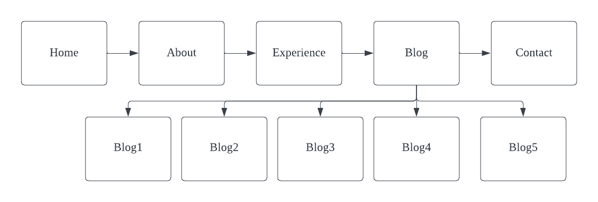

4.Screenshots 

### Mobile view

#### home page

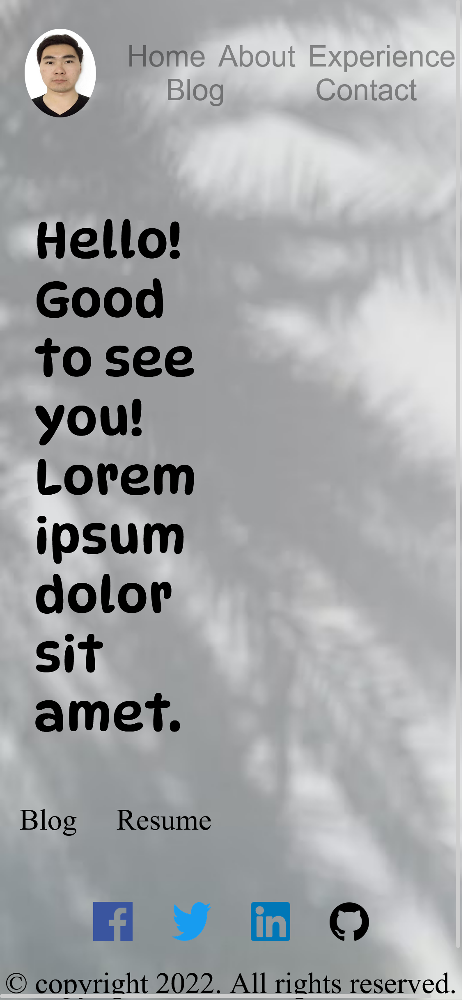

#### about page 

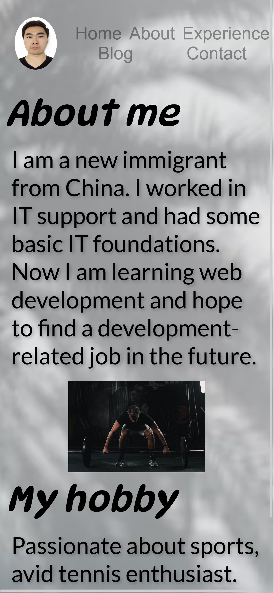

#### experience page 

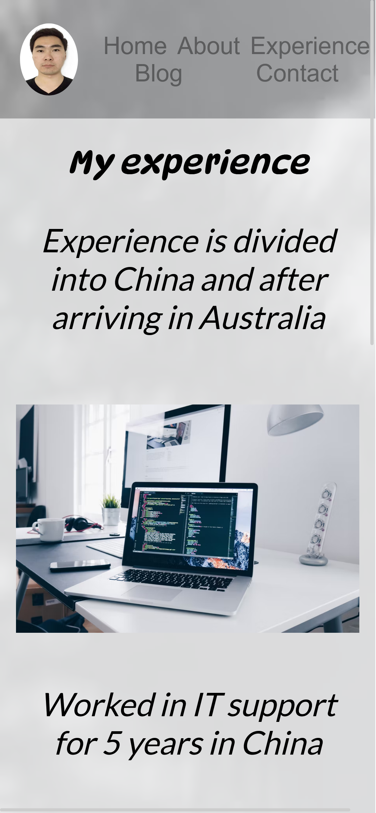

#### blog page 

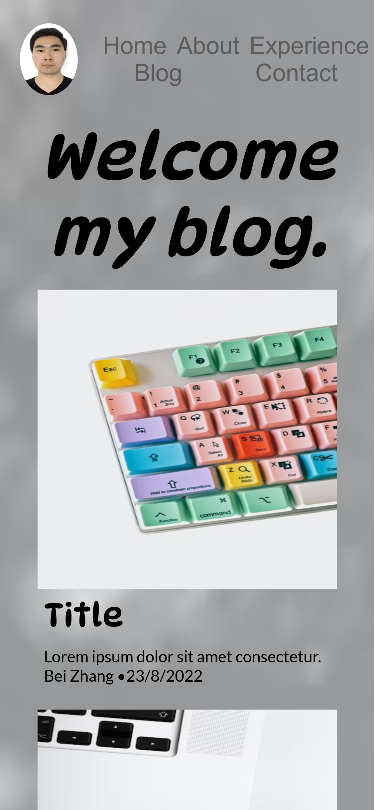

#### contact page 

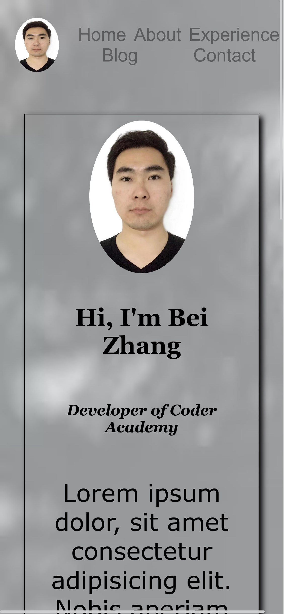

### tablet view

#### home page

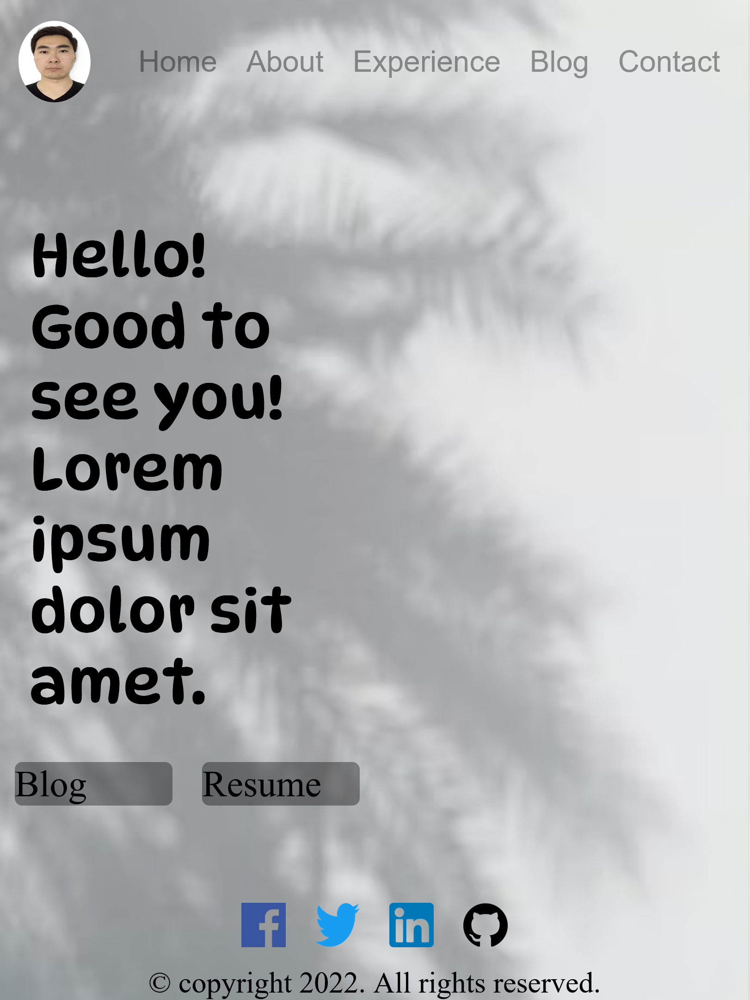

#### about page 

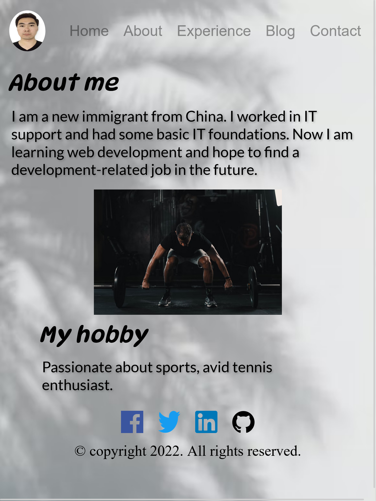

#### experience page 

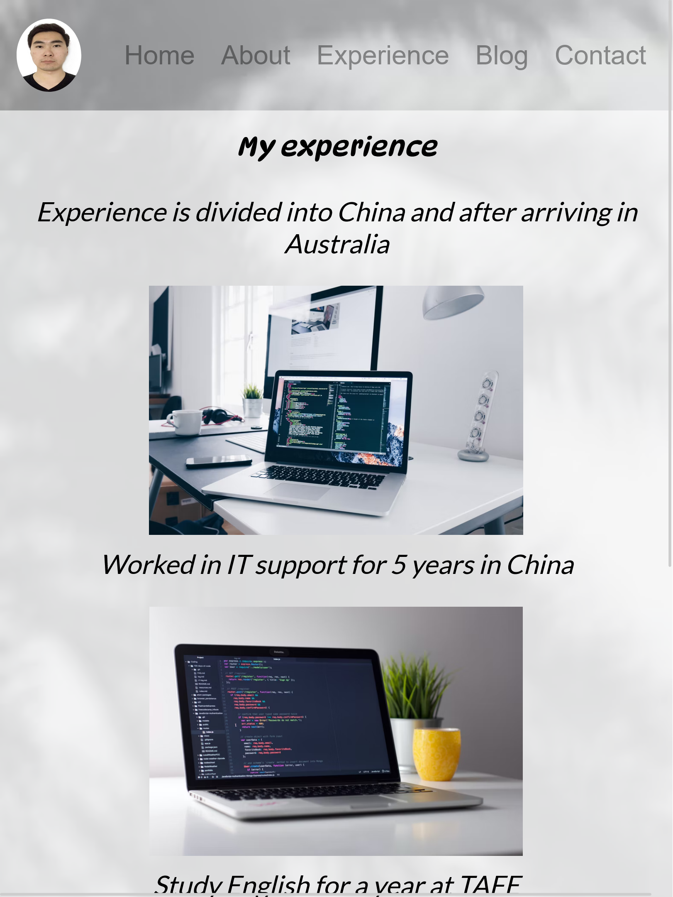

#### blog page 

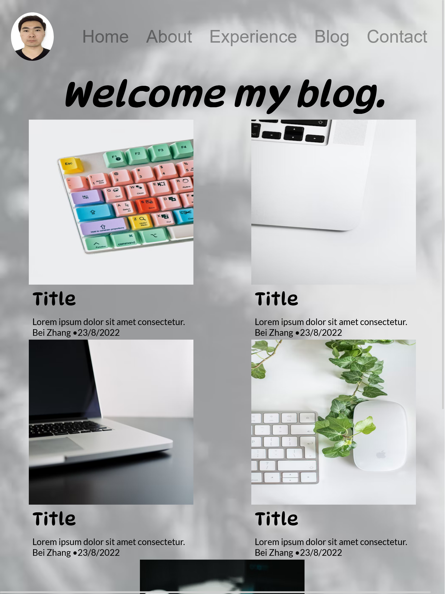

#### contact page 

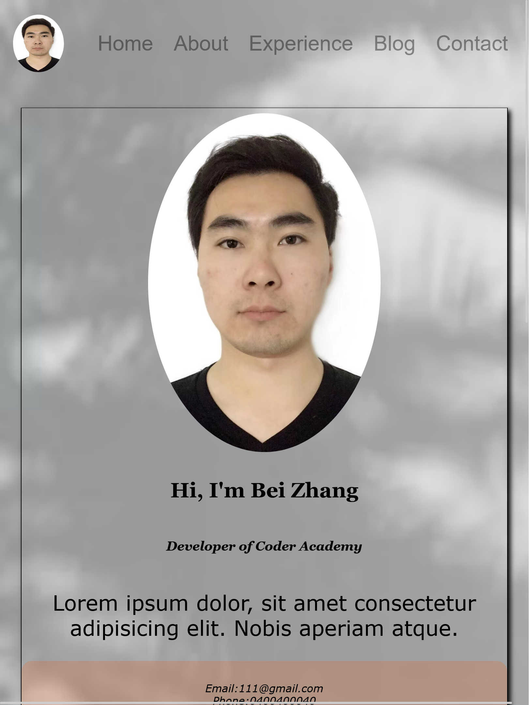

### desktop view

#### home page

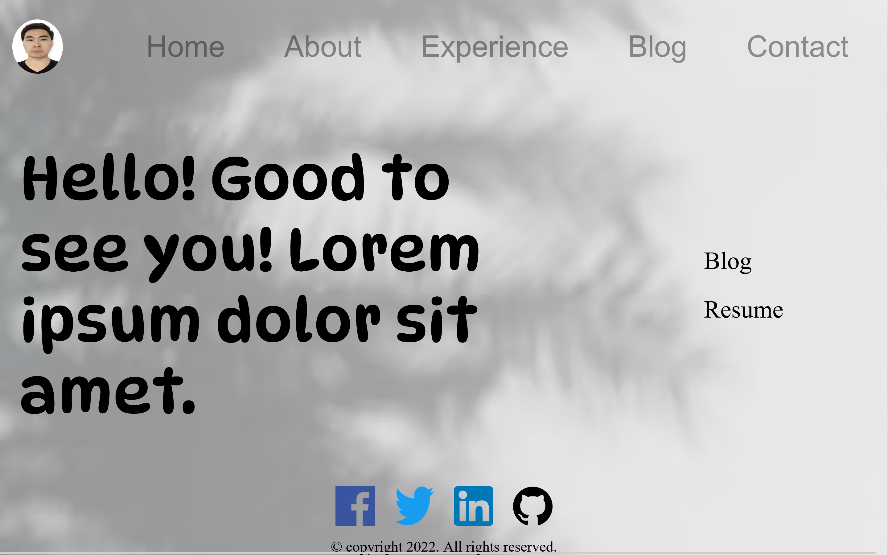

#### about page 

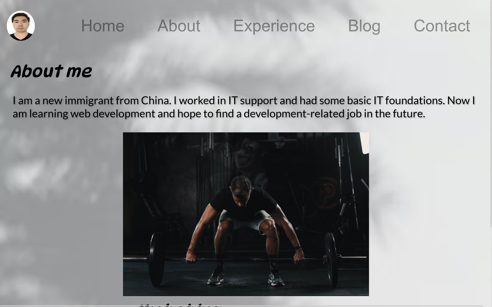

#### experience page 

#### blog page 

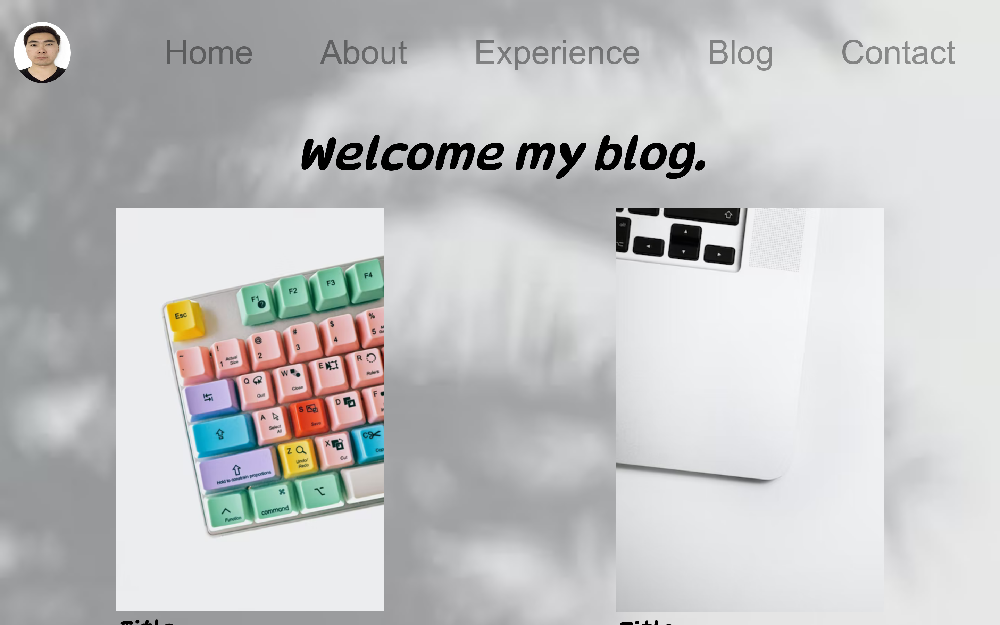

#### contact page 

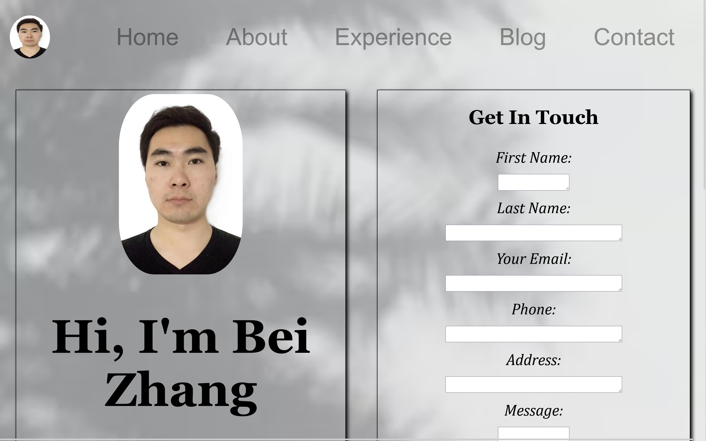

5.Target audience 

The target audience of my portfolio website is future employers and developers as well as myself. I have only made a simple version of it so far, and I will continue to improve it later, and I believe it will stay with me for a long time. 

6.Tech stack 

I learned to use Lucid to draw sitemap and wireframe, use HTML and CSS in VS to make web pages, as well as use W3school to check code correctness, use Markdown to write documentation, put my work in Github when it is finished, and finally publish it with Netlify.
